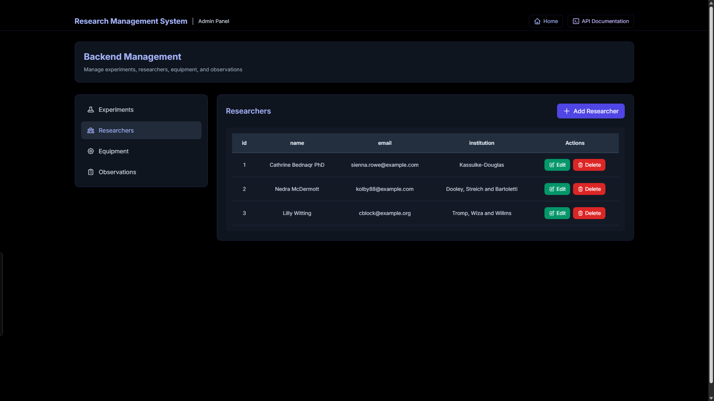
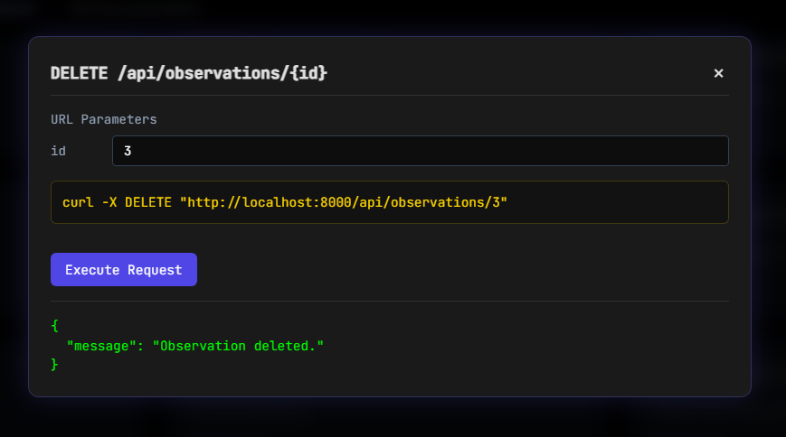

# Research Management System

A comprehensive backend system for managing research experiments, researchers, equipment, and observations. Built with Laravel, this system provides a robust API for handling all aspects of research management.

## Features

- **Experiment Management**: Create, read, update, and delete research experiments
- **Researcher Profiles**: Manage researcher information and their associated experiments
- **Equipment Tracking**: Keep track of laboratory equipment and their usage
- **Observation Records**: Document and manage experiment observations
- **Interactive API Documentation**: Built-in API testing interface with real-time curl command generation
- **Admin Panel**: User-friendly interface for managing all aspects of the system

## Technology Stack

- **Backend Framework**: Laravel (PHP)
- **Database**: MySQL
- **Frontend**: Blade Templates with Tailwind CSS
- **API Documentation**: Custom-built interactive documentation

## API Endpoints

The system provides the following RESTful API endpoints:

### Experiments
- `GET /api/experiments` - List all experiments
- `GET /api/experiments/{id}` - Get experiment details
- `POST /api/experiments` - Create a new experiment
- `PUT /api/experiments/{id}` - Update an experiment
- `DELETE /api/experiments/{id}` - Delete an experiment

### Researchers
- `GET /api/researchers/{id}` - Get researcher details
- `GET /api/researchers/{id}/experiments` - Get experiments by researcher

### Equipment
- `GET /api/equipment/{id}` - Get equipment details
- `GET /api/equipment/{id}/experiments` - Get experiments using specific equipment

### Observations
- `GET /api/observations/{id}` - Get observation details
- `GET /api/experiments/{id}/observations` - Get observations for an experiment

## System Interface

### Landing Page
The system's landing page provides a modern, intuitive interface with quick access to all major features.


### Admin Panel
The admin panel provides a user-friendly interface for managing:
- Experiments
- Researchers
- Equipment
- Observations



### API Documentation
The system includes a built-in interactive API documentation interface that allows you to:
- View all available API endpoints
- Test endpoints directly from the browser
- Generate curl commands in real-time
- Handle URL parameters and request bodies
- View formatted API responses


### Interactive Elements
The system features various interactive elements that enhance user experience:
- Dynamic form inputs
- Real-time validation
- Responsive design elements
- Modern UI components


### In-Browser Terminal
The interactive terminal interface for testing API endpoints provides:
- Real-time curl command generation
- Parameter input handling
- Request body editing
- Formatted response display
- Blurred background overlay for focus



## Installation

1. Clone the repository:
```bash
git clone [repository-url]
```

2. Install dependencies:
```bash
composer install
```

3. Configure your environment:
```bash
cp .env.example .env
php artisan key:generate
```

4. Set up your database in `.env`:
```
DB_CONNECTION=mysql
DB_HOST=127.0.0.1
DB_PORT=3306
DB_DATABASE=research_management
DB_USERNAME=your_username
DB_PASSWORD=your_password
```

5. Run migrations:
```bash
php artisan migrate
```

6. Start the development server:
```bash
php artisan serve
```

## Usage

1. Access the landing page at `/`
2. Navigate to the API documentation at `/api-list`
3. Use the interactive interface to test API endpoints
4. Access the admin panel at `/admin` for full system management

## API Testing

The system provides an interactive terminal interface for testing API endpoints:

1. Click "Try it out" on any API endpoint
2. Enter required parameters (if any)
3. Add request body for POST/PUT/PATCH requests
4. Click "Execute Request" to test the endpoint
5. View the formatted response

## Project Structure

```
├── app/
│   ├── Http/
│   │   ├── Controllers/
│   │   └── Middleware/
│   └── Models/
├── database/
│   └── migrations/
├── resources/
│   └── views/
├── routes/
│   ├── api.php
│   └── web.php
└── tests/
```

## Contributing

1. Fork the repository
2. Create your feature branch
3. Commit your changes
4. Push to the branch
5. Create a new Pull Request

## License

This project is licensed under the MIT License - see the LICENSE file for details.

## Acknowledgments

- Laravel Framework
- Tailwind CSS
- All contributors and users of the system